<!-- Header -->
<div align="center">
  
</div>

<h1 align="center">Hill Patel (Stifler) ⚡ AI Architect</h1>

<p align="center">
  <b>Research • Systems • Deployment • Edge AI</b>
</p>

---

### 👨‍💻 `user_profile.py`

```python
class Hill_Patel(AI_Architect):
    """
    Building the bridge between cutting-edge Research and Production AI systems.
    """
    def __init__(self):
        self.username = "STiFLeR7"
        self.role = "AI Engineer & Full-Stack Architect"
        self.focus = [
            "Large Language Models (LLMs)",
            "Edge AI & Quantization", 
            "RAG Pipelines",
            "Scalable Cloud Systems"
        ]
        self.mission = "Deploying Intelligence Efficiently"

    def get_stack(self):
        return {
            "core": ["PyTorch", "TensorFlow", "HuggingFace"],
            "deploy": ["FastAPI", "Docker", "Kubernetes", "GCP"],
            "edge": ["ONNX", "TensorRT", "GGUF/GPTQ"],
            "web": ["Next.js", "React", "Tailwind"]
        }

if __name__ == "__main__":
    me = Hill_Patel()
    me.deploy("Production")
```

---

### 🧠 **System Architecture**

```mermaid
graph LR
    A[Data Ingestion] --> B{Model Design}
    B -->|Research| C[PyTorch/HF]
    B -->|Fine-Tuning| D[LoRA/QLoRA]
    C & D --> E[Optimization]
    E -->|Quantization| F[GGUF/GPTQ/AWQ]
    E -->|Edge| G[ONNX/TRT]
    F & G --> H[Deployment]
    H --> I[FastAPI/Docker]
    H --> J[Mobile/Edge Devices]
    style A fill:#1e1e1e,stroke:#f5a623,stroke-width:2px
    style B fill:#1e1e1e,stroke:#f5a623,stroke-width:2px
    style H fill:#1e1e1e,stroke:#00bcd4,stroke-width:2px
```



---

### � **Tech Stack Layers**

<table align="center">
  <tr>
    <td align="center" width="90">
      
      <br><b>Core AI</b>
    </td>
    <td align="center" width="120">
      
      <br><b>Infrastructure</b>
    </td>
    <td align="center" width="90">
      
      <br><b>Backend</b>
    </td>
    <td align="center" width="90">
      
      <br><b>Frontend</b>
    </td>
  </tr>
</table>

---

### 🚀 **Selected Projects**

| Project | Type | Tech | Description |
| :--- | :--- | :--- | :--- | 
| **[imgshape](https://github.com/STiFLeR7/imgshape)** | 📦 Open Source | `Python` `CLI` `PyPI` | Dataset intelligence framework (>4.5k downloads). Auto-reports & pipeline export. |
| **[FastFare](https://github.com/STiFLeR7/FastFare)** | 🏢 Startup | `RAG` `Next.js` `FastAPI` | Logistics assistant with automated RAG pipeline & vector search. |
| **[TTGv1-Docker](https://github.com/STiFLeR7/TTGv1-Docker)** | 🏭 Enterprise | `Docker` `OR-Tools` `Redis` | Scalable scheduling engine resolving constraint problems. |
| **MedMNIST-EdgeAI** | 🔬 Research | `KD` `EdgeAI` `Vision` | **(Paper Under Review)** Compressing medical models for mobile deployment using Knowledge Distillation. |

---

### 📝 **Latest Research & Articles**
<!-- BLOG-POST-LIST:START -->
- 🧠 [MedMNIST-EdgeAI: Compressing Medical Imaging Models for Efficient Edge Deployment](https://medium.com/@stiflerxd/medmnist-edgeai-compressing-medical-imaging-models-for-efficient-edge-deployment-e12f160d6f36)
- 🧠 [LCM vs. LLM + RAG](https://medium.com/@stiflerxd/lcm-vs-llm-rag-11f656f1c71e)
- 🧠 [Edge-LLM: Running Qwen2.5–3B on the Edge with Quantization](https://medium.com/@stiflerxd/edge-llm-running-qwen2-5-3b-on-the-edge-with-quantization-1a825de3d722)
<!-- BLOG-POST-LIST:END -->

---

### � **Metrics**
<div align="center">
  
  
</div>

<div align="center">
  <a href="https://hillpatel.tech">🌐 Portfolio</a> • 
  <a href="https://medium.com/@stiflerxd">✍️ Medium</a> • 
  <a href="https://huggingface.co/STiFLeR7">🤗 HuggingFace</a>
</div>
